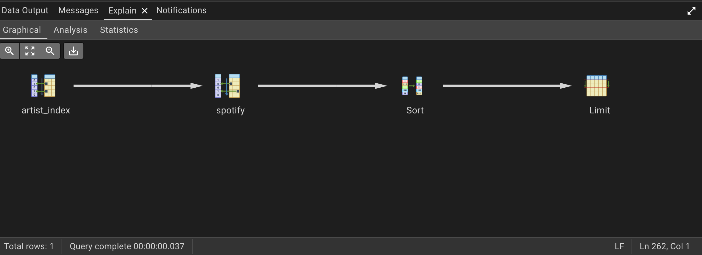

Advanced SQL Project – Spotify Datasets

* Project Overview

This project focuses on Advanced SQL queries and query optimization using PostgreSQL with Spotify Datasets. We will demonstrate database creation, table setup, data import, indexing, and query performance analysis using pgAdmin 4.

* Setup Instructions:

1️. Register a New Server in pgAdmin4

    -  Open pgAdmin4.
    - Navigate to Servers → Right-click → Register Server.
    -  Fill in the required fields:
        - General → Provide a name for the server.
        - Connection → Enter:
            - Host Name
            - Port
            - Maintenance Database
            - Username
            - Password
    - Click Save to register the server.

2. Create a New Database

    - Navigate to Databases → Right-click → Create → Database.
    - Provide a name for the database and save it.
    - Open the Query Tool and execute the SQL script to create tables.
    - Verify the table under Schemas → Tables.

3. Import Data into the Table

    - Right-click on the created table → Import/Export Data.
    - Choose the file path containing the dataset.
    - Adjust import options:
        - Add Headers
        - Escape characters → "
        - Click OK to import data.

4. View imported data 
    - Right-click on the table → View/Edit Data → First 100 Rows.
    - Count total rows: Right-click on the table → Count Rows.

* Query Optimization

# Running an SQL Query

SELECT
 	artist,
	track,
	views
FROM spotify
WHERE artist = 'A Day To Remember'
	AND
	most_played_on = 'Spotify'
ORDER BY stream DESC
LIMIT 8;

# Analyze Query Performance

- Select the query in pgAdmin and click on Explain.

- PostgreSQL provides a Graphical Execution Plan,Analysis and Statistics.

📌 Query Analysis Before Indexing

Graphical: 
    

    
    Analysis:
    

📌 Explain Analyze Output:

    EXPLAIN ANALYZE -- Planning Time: 0.109 ms -- Execution Time: 8.630 ms
    SELECT
        artist,
        track,
        views
    FROM spotify
    WHERE artist = 'A Day To Remember'
        AND
        most_played_on = 'Spotify'
    ORDER BY stream DESC
    LIMIT 8;

    - Select this query and Execute it:

    

* Creating an Index for Optimization

    - Create an Index on the artist column

        CREATE INDEX artist_index ON spotify (artist);

📌 Query Analysis After Indexing

    Graphical:   
        

    Analysis:
        

📌 Explain Analyze Output:

    EXPLAIN ANALYZE -- Planning Time: 0.183 ms -- Execution Time: 0.262 ms
    SELECT
        artist,
        track,
        views
    FROM spotify
    WHERE artist = 'A Day To Remember'
        AND
        most_played_on = 'Spotify'
    ORDER BY stream DESC
    LIMIT 8;

    - Select this query and Execute it:

    

* Key Takeaways

- Query Optimization: Indexed queries execute significantly faster.
- EXPLAIN ANALYZE: Provides in-depth insights into query performance.
- Indexing Strategy: Creating indexes on frequently filtered columns enhances performance.

