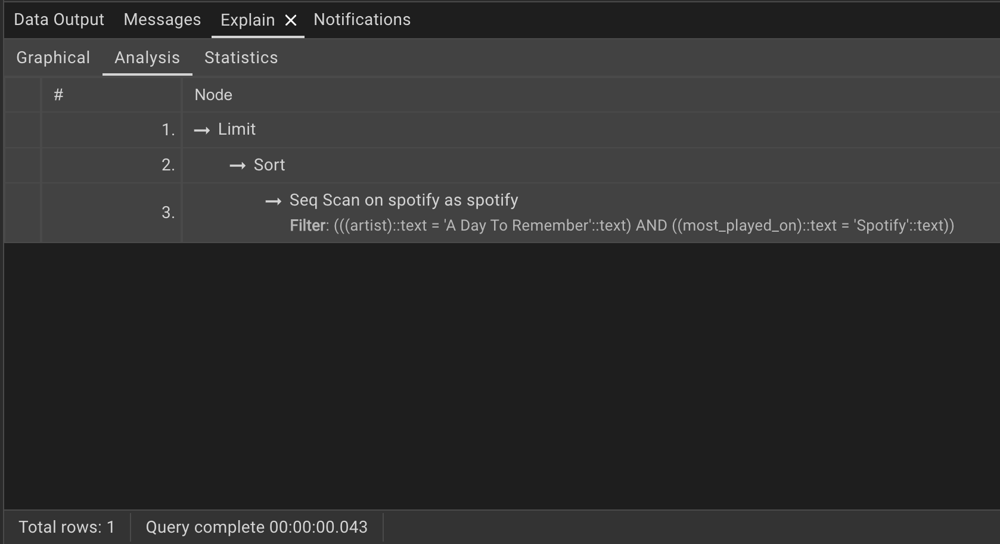
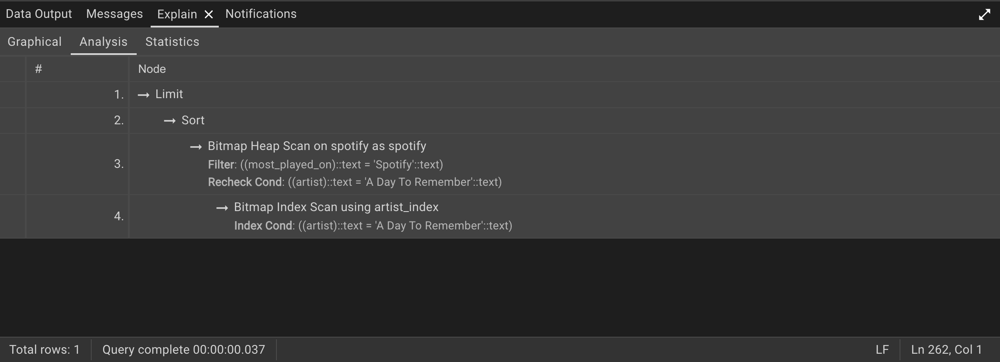
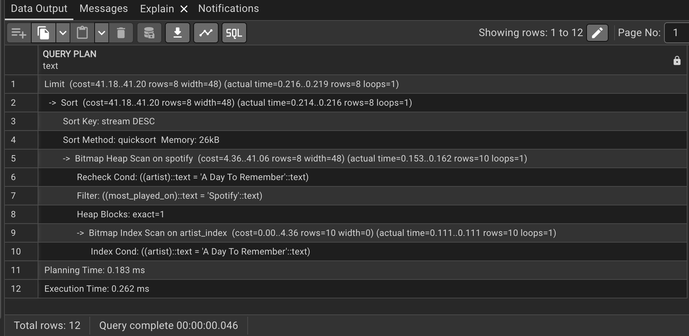

# Advanced SQL Project – Spotify Datasets

# Project Overview

This project focuses on Advanced SQL queries and query optimization using PostgreSQL with Spotify Datasets. We will demonstrate 	database creation, table setup, data import, indexing, and query performance analysis using pgAdmin 4.

# Setup Instructions:

1. Register a New Server in pgAdmin4

    - Open pgAdmin4
    - Navigate to Servers → Right-click → Register Server
    - Fill in the required fields:
    - General → Provide a name for the server.
    - Connection → Enter:
         - Host Name
         - Port
         - Maintenance Database
         - Username
         - Password
    - Click Save to register the server.

2. Create a New Database

    - Navigate to Databases → Right-click → Create → Database.
    - Provide a name for the database and save it.
    - Open the Query Tool and execute the SQL script to create tables.
    - Verify the table under Schemas → Tables.

3. Import Data into the Table

    - Right-click on the created table → Import/Export Data.
    - Choose the file path containing the dataset.
    - Adjust import options:
        - Add Headers
        - Escape characters → "
        - Click OK to import data.

4. View imported data
   
    - Right-click on the table → View/Edit Data → First 100 Rows.
    - Count total rows: Right-click on the table → Count Rows.

# Project Steps

1. Data Exploration
	Before diving into SQL, it’s important to understand the dataset thoroughly. The dataset contains attributes such as:
	
	- Artist: The performer of the track.
	- Track: The name of the song.
	- Album: The album to which the track belongs.
	- Album_type: The type of album (e.g., single or album).
	- Various metrics such as danceability, energy, loudness, tempo, and more.
2. Querying the Data
	After the data is inserted, various SQL queries can be written to explore and analyze the data. Queries are categorized into easy, 	medium, and advanced levels to help progressively develop SQL proficiency.
	
	- Easy Queries
		- Simple data retrieval, filtering, and basic aggregations.
	- Medium Queries
		- More complex queries involving grouping, aggregation functions, and joins.
	- Advanced Queries
		- Nested subqueries, window functions, CTEs, and performance optimization.
3. Query Optimization
	In advanced stages, the focus shifts to improving query performance. Some optimization strategies include:
	
	- Indexing: Adding indexes on frequently queried columns.
	- Query Execution Plan: Using EXPLAIN ANALYZE to review and refine query performance.

# Query Optimization

* Running an SQL Query

	SELECT
	 	artist,
		track,
		views
	FROM spotify
	WHERE artist = 'A Day To Remember'
		AND
		most_played_on = 'Spotify'
	ORDER BY stream DESC
	LIMIT 8;

* Analyze Query Performance

	- Select the query in pgAdmin and click on Explain.
	
	- PostgreSQL provides a Graphical Execution Plan,Analysis and Statistics.

	📌 Query Analysis Before Indexing
	
	Graphical: 
	    	
	    
	Analysis:
	    	
	
	📌 Explain Analyze Output:

	    EXPLAIN ANALYZE -- Planning Time: 0.109 ms -- Execution Time: 8.630 ms
	    SELECT
	        artist,
	        track,
	        views
	    FROM spotify
	    WHERE artist = 'A Day To Remember'
	        AND
	        most_played_on = 'Spotify'
	    ORDER BY stream DESC
	    LIMIT 8;
	
	- Select this query and Execute it:

		

* Creating an Index for Optimization

    - Create an Index on the artist column

      		CREATE INDEX artist_index ON spotify (artist);

	📌 Query Analysis After Indexing
	
	Graphical:   
		
	
	Analysis:
	        

	📌 Explain Analyze Output:
	
	    EXPLAIN ANALYZE -- Planning Time: 0.183 ms -- Execution Time: 0.262 ms
	    SELECT
	        artist,
	        track,
	        views
	    FROM spotify
	    WHERE artist = 'A Day To Remember'
	        AND
	        most_played_on = 'Spotify'
	    ORDER BY stream DESC
	    LIMIT 8;
	
	- Select this query and Execute it:
	
	  	

# Key Takeaways

- Query Optimization: Indexed queries execute significantly faster.
- EXPLAIN ANALYZE: Provides in-depth insights into query performance.
- Indexing Strategy: Creating indexes on frequently filtered columns enhances performance.

